# Creating, hosting, and pubishing Leaflet maps with qgis2web and GitHub

## Getting started

### Downloads and accounts
This tutorial was made using Mac iOS High Sierra v 10.13.6. The following software is used and should be installed before beginning:

- [QGIS3](https://qgis.org/en/site/forusers/download.html)--[video for Mac install assistance](https://www.youtube.com/watch?v=908NyL7roFs)
- [GitHub account](https://github.com/)
- [GitHub Desktop](https://desktop.github.com/)
- [Atom text editor](https://atom.io/)
- [Firefox](https://www.mozilla.org/en-US/firefox/new/) and/or [Chrome](https://www.google.com/chrome/) web browsers--I like viewing and testing the map in multiple browsers
- [Google account](https://support.google.com/accounts/answer/27441?hl=en) (i.e., Gmail account)
- Google Sheets, Excel, or another spreadsheet editor
- Access to command line such as Terminal (MacOS)
- Optional: website. If using WordPress, a business account and iFrame plugin are required.

## Create a GitHub repository
This tutorial uses git and GitHub mostly through the desktop and the online interface rather. All steps for creating new repositories, publishing, and pushing changes are possible in Terminal or a command line tool, too. See the [GitHub Cheat Sheet](https://education.github.com/git-cheat-sheet-education.pdf) for the commands.

1. Go to [github.com](https://github.com/) and login. Create a new account if needed.

2. Next to **Repositories** click **New** to create a new repository. Provide a name at a minimum. Fill out the information. A license is not required, but I Like to use [Creative Commons](https://creativecommons.org/)

  

3. Under **Quick setup**, click the button beneath it for **Set up in Desktop**. If a window appears in the browser asking how to open it, choose the option **Open GitHub Desktop.app**.

  

4. Make sure the local desktop path looks correct, i.e., somewhere you will remember, and click **clone**.

## List places and draft text
While I am traveling, I make sure to write down the names of the places that I visit: restaurants, sites, etc.

1. Create a new spreadsheet using a software of choice. For example, Google Sheets, Excel, Calc, etc. If creating an spreasheet with a desktop software, create it in the git repository created in the previous section.

2. In the new spreadsheet create a column titled **Place** and a column titled **Description**.

2. In the Place column list the places visited to display on the map.

3. Once the places are listed, in the adjacent column titled Description write the content that described your experience that you want to share about the place. This text will also be used later on to create the text description to post below the map. Limit the text to 2-3 **sentences** if at all possible.

4. Additional columns can be added here now or later in another step. Some additional columns to consider are categories for place type (site, accommodation, food & drink, etc.) and images (only use an image column if **all places** have an associated image).

## Image processing
### Resize images
These instructions are for Mac. The command may or may not be compatible with other operating systems.
1. Load photos to computer. I take photos with an iPhone, so I use AirDrop.

2. In the git repository for the project, create a **new folder** titled **images**.

3. **Copy** photos into git repository folder titled images. Make sure to **COPY** the images or have a backup because these images will be resized.

4. (Optional) Rename the photos to something simpler or more systematic to make it easier to link them with the corresponding places in a later step.

5. Open **Terminal**. If you are not sure where Terminal is, type Terminal into Mac's spotlight.

  

6. Change the directory using the command `cd` (change directory) to the git repository with the images. For example, use a relative file path like:

  ```
  cd git/2019_oslo/images
  ```
  - If you are uncertain of the relative path or how to use it, use the `cd` (change directory) command through each subfolder to get to the images directory:

  ```
  cd git
  cd 2019_oslo
  cd images
  ```

7. Once Terminal shows that it is in the correct directory for the images for this project, use the following code to resize **all images to 300 pixels**, or the desired size:

  ```
  sips -Z 300 *.jpg
  ```
  - In the above code the **300 is the pixel width**--the height is auto-scaled. I do not suggest using anything larger than 300 pixels in the leaflet popup. These maps are not exactly the best platform for showcasing high-quality images. Include a link to a high-quality image if you would like.
  - The * (asterisk) represents choosing **all files** in the directory with the file type **.jpg.** - If your files are **not .jpg**, change it to **.tiff, .png, etc.**
  - The code above is **case sensitive.** Meaning, sometimes I need to run this **twice** because the file type of some images are **.JPG** and not **.jpg**.

### Publish and push images to GitHub
8. Open GitHub Desktop.

  - If not already selected, select the project repository from the top left.
  - Notice in the changes on the left side that the relative path for all images added are listed.
  - (Optional for Mac) I like to delete or set up a .gitignore for the .DS_Store files because it is not necessary. Right click the .DS_Store file for either of these options.


9. At the bottom of the column on the left, type in a summary such as initial commit. If working with others on this project, it is usually good to add a more detailed description.

10. Click **Commit to master**.

  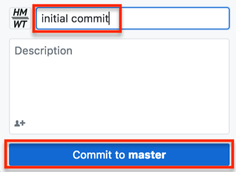

11. This is probably the first thing added to the repository, so click **Publish branch** in the top right. After publishing, in the future the box will say either Fetch origin or Push origin. Depending on how many images are in the folder and their size or how many changes were made to the repository, this can take a few moments. If it is taking a very long time, it may be because the images were not resized.

    

### Create html image links
1. Go to [GitHub.com](https://github.com), and go to the project repository.

2. Click the ** images** folder.

3. Click on an individual image link in the folder.

4. Right click the image, and choose **Copy Image Address**.

  

5. Open the spreadsheet with the place names and descriptions from the **List places... section**.

6. Paste the image link into an empty column in the appropriate row where the image depicts the place listed and described. If using a new spreadsheet, place it  **A1**.

  

7. Keep copying and pasting image addresses next to any place with a corresponding image for all remaining images.
  - **Note**: There are many ways to get the image links into the spreadsheet. For example, you can also copy and paste a single image link down the spreadsheet and change just the image name in the link. If there are more than 20 images, finding an automated way to capture addresses may be helpful.


8. In an empty cell in the rows with images, **create alt text** to be read by screen readers or to display when the image does not appear. Alt text should be descriptive of the image **not** the experience.

  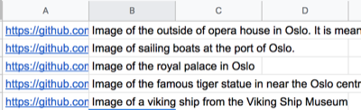

9. In the first empty cell in the next empty column type `=CONCATENATE` to activate the Concatenate formula.

10. Within the Concatenate formula parentheses () type: ``""``. In the formula the plus sign (+) acts as a placeholder for quotation marks needed in the html. Quotations may or may not work with the Concatenate formula in your spreadsheet software, but it defeinitely does not work in Google Sheets.

11. Copy this formula down the column.

12. Copy the column and **paste as values** in the next empty column. In Google Sheets, use **command + shift + v** to paste as values, or right click/control click the first empty cell and choose Paste Special>Paste Values Only.

13. Use **find and replace** to replace the **+**, or special character used, as a placeholder with a quotation mark.
  - Highlight the column where the formula was pasted as **values only**. This will make sure only this range is searched for find and replace.
  - Press command or ctrl + F to open **find and replace** in Google Sheets.
  - In Google Sheets, press the three stacked dots at the right of the window for more options.
  - Type **+** in Find and **"** in Replace with. Select replace all. Then, press Done.

  

  

14. **Delete** the column with the Concatenate formula, NOT the column with the final image link.

14. Now, there are a few options for how to integrate the image links:
  - **Concatenate** the Description column and the column with the final image links. If doing this, add a html manual line break `<br>` in the concatenate formula. This will NOT show the line break immediately, but the break **should** appear in the final map.
  - In the column with the final image links, add the column title **Image**.

## Create geospatial data with Google MyMaps

### Google MyMaps
There are any number of ways to get coordinates for the places in the spreadsheet ready to map. I usually start by creating a map with [mymaps.google.com](https://mymaps.google.com), which the following steps will demonstrate. These steps are only for creating and adding vector data (points, lines, polygons). If wanting to use raster data (e.g., georeferenced scanned maps), add that at a later point in QGIS.

#### Why I use Google My Maps:
- Sometimes the places I visit might not have a precise address or indexed location (e.g., campsites, sailing locations) or I am not familiar enough with the language to identify if the place that comes up in Google is correct, so I really like being able to identify or double check the location with the Google Earth imagery and streets.
- I do find the Google search to be good for places that are known by Google. However, if the Google place is incorrect, it is easy to move the point manually.
- With Google MyMaps you can easily create your own and import points, lines, and polygons.

#### Alternative options
If you have **more than 20 places** to map that are likely to be known places names in Google:
  - Use [Geocode by Awesome Table](https://support.awesome-table.com/hc/en-us/sections/360000012309-Geocode) on the Google Sheet used in the previous sections
  - Download the sheet as a Comma Separated Values file (.csv)
  - Either add it to MyMaps to check the geocoding or [import the CSV to QGIS](https://www.qgistutorials.com/en/docs/importing_spreadsheets_csv.html). If anything appears incorrectly in MyMaps, manually move any that are in the incorrect place and/or add any places that did not appear at all.

If you are not using Google Sheets or if you do not want to use the Geocode by Awesome Table add-on, there are many manual and batch ways to get latitude and longitude for place names:
  - [latlong.net](https://www.latlong.net/)
  - [batchgeo.com](https://batchgeo.com/)
  - [geocode.localfocus.nl](https://geocode.localfocus.nl/)

### Add places to MyMaps
1. Go to [mymaps.google.com](https://mymaps.google.com). If you do not have a [Google account](https://accounts.google.com/SignUp), create one to save projects.

2. Click the red circle with the plus sign in the bottom right to create a new map.

3. Search for a place traveled in the search bar by typing it in or copying it from the spreadsheet and pressing enter/return or clicking the magnifying glass button.

  
  - **Alternatively**, import the spreadsheet you have been working in and see if Google can identify the places.


4. If the place appears in the correct place, click **+Add to map** in the bottom of the pop up box.
If the place does **not appear**, zoom around the map to try to find the approximate location, and then, click the **balloon icon below the search bar** to manually add a marker.
  - Repeat either process for all places.
  - Keep all like data (e.g., all points) in one layer.
  - This method is recommended for fewer than 20 places, or as many places as you can stand to add manually.

    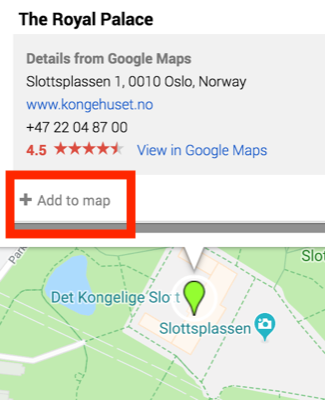

5. Next to the layer title, which is probably **Untitled layer**, click the **three stacked dots**, and then, click **Open data table.**

  

6. At this point, it is possible to add new columns and copy in text descriptions, image links, and categorical data about the places.
  - This is when I like to copy the text description and image links from the Google Sheet into the table.
  - I usually add the image link in the description, but some may prefer to have it in its own column, especially if every place has an image.
  - When adding image links to the description column, **add a manual line break** in the cell between the text and link using **shift + enter/return**. Just using enter/return will select the next cell.
  - Whether adding an image link from the spreadsheet or creating a new one here, the image link should look something like: ``
  - **Image links will appear as this html text NOT an image. The image will not appear until it is in the final Leaflet map**
  - If preferred, add categories for the places, such as site, lodging, food.
  - To capitalize or change the column titles, click the column title dropdown and choose **Duplicate**. In the popup, change the title to the desired word or phrase. **Single words are preferable**. Then, delete the old column.


### Export KML
When the data table is filled out and all places appear on the map, export the data from MyMaps to use in QGIS.
1. To the right of the map title, click the three stacked dots.

  

2. Choose **Export to KML/KMZ**.

  

3. In the pop up, check the option for **Export as KML instead of KMZ.**

  

4. Click **Download**.

5. Add the downloaded .kml file to the git repository folder on the desktop.

    

## Working with QGIS
**Note**: If downloading QGIS3 for the first time on a Mac, [watch this video](https://www.youtube.com/watch?v=908NyL7roFs). It is not a one-click install on Mac.

### Saving a project

1. Open QGIS.

2. Use command + S, click the floppy disc icon in the top left of QGIS, **OR** click File>Save.

3. Navigate to the git repository for this project.

4. Name the QGIS project file.

5. Make sure the file type is **.qgz**.

    

6. While working in QGIS, periodically save the project. Saving the project makes sure layer styles and all other project properties, including qgis2web Leaflet properties, are saved when the project is closed or when it is shared with others.

### Installing QGIS Plugins
1. Open QGIS.

2. Click **Plugins** from the top menu.

      

3. Click **Manage and Install Plugins...**.

      

4. Make sure **All** is selected from the left side of the popup window, and in the search box, type **qgis2web**. **Note**: an internet connection is required to search for and install plugins this way.

      

5. Select the result **qgis2web** so that the information about the plugin appears on the right side of the window.

6. Below the plugin description, click **Install plugin**.

      

7. In the search results, make sure the box next to it is checked so that it appears.

      

8. Search for **QuickMapServices**, and click **Install Plugin**. Make sure the box next to it is checked, too.

      

8. When both plugins are installed, close the plugins window. Not sure if they are installed? Click the **Installed** tab in the Plugins window.

9. From the **top menu**, click **Web**. Qgis2Web and QuickMapServices should both appear there. If not, quit QGIS and reopen it. If it still does not appear, go back to the manage and install plugins window and check that these are listed in Installed Plugins. If the plugins are listed there, make sure the box to the left of the plugin is checked.

      

### Create Projected GeoJSON
Now, the data from MyMaps needs to be **reprojected** to match the OpenStreetMap projection: EPSG 3857. This is a required step even if using a different basemap from the web such as Google or MapBox. This step is not necessary if you are **not** using a basemap at all or have created your own basemap either with georeferenced imagery/maps or vector data.
1. Open QGIS if it was closed after the last section.

2. Drag the **downloaded KML** with the data for this project into the **Layers panel**. If the Layers panel is not open, from the top menu click **View>Panels>Layers**.

      

3. Open the **Processing Toolbox** panel. Do this by clicking the gear icon, **or** from the top menu, **View>Panels>Processing Toolbox**.

4. Search for **reproject**, and double click **Reproject layer** under Vector general.

  


6. For the **parameters** in the window that appears:
  - **Input layer** should be the kml from MyMaps. Search for it if necessary
  - The **Target CRS is EPSG:3857**. If it is not in the dropdown, click the **globe icon** and **search for 3857**. This projection appears under Projected Coordinate Systems>Mercator>WGS 84 / Pseudo-Mercator, Authority ID EPSG:3857.
  - For **Reprojected**, click the **three dots**, and choose **Save to File**.
  - In the navigator, change the output file type to **.geojson**, give it a name, and choose the **Git repository** for this project as the **file directory path** to save the output.

    

7. When the screen looks like the above image, click **Run** in the bottom right of the Reproject Layer window.

8. Close the Reproject Layer window when the Log tab shows the layer was reprojected successfully by displaying the message **"Algorithm 'Reproject Layer' finished"**

8. **Remove all layers** from the Layers panel by right clicking them and choosing Remove Layer or highlighting layers and clicking the Remove icon in the Layers panel.

  

9. Add the reprojected layer by dragging it into the Layers panel. The layer **should** be in the git repository--if it is not, move it there before placing in the layers panel. This is the only item that should appear in the Layers panel! Additionally, make sure you can see the points in the QGIS workspace area.

  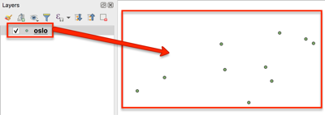

10. Click Web>QuickMapServices>OpenStreetMap>OSMStandard.

  

11. Do the places look correct on top of the OpenStreetMap basemap?

  

### Edit the data
KML files come with a lot of extra columns, and this carried over to the geojson. Let's fix that and more!

1. Make sure QGIS is open and the reprojected geojson is in the Layers Panel.

2. Right click the layer in the Layers panel, and choose open attribute table.

  

3. To edit the attribute table, click the pencil icon in the top left of the attribute table or use Command + E (Mac).

  

4. To start deleting empty columns, click the **Delete field icon**, highlighted in the image below. This icon appears when editing mode is turned on.
**Note**: Deleting a column is permanent. You may want to copy the geojson if this is your first time just in case.

  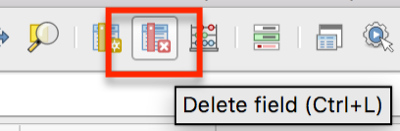

5. In the window that appears, click the following columns to select them for deletion:
  - timestamp
  - begin
  - end
  - altitudeMode
  - tessellate
  - extrude
  - visbility
  - drawOrder
  - icon

    

6. Once all the necessary columns are highlighted, click OK.

7. If the correct columns were deleted, click the floppy disc icon in the top left to save edits.

  

8. While in the attribute table, make any other content edits.

9. Click the pencil icon in the top left again when finished. Make sure to save edits.

### Styling the map
You may wish to style the points or categorize the data on the map. If you have never styled or categorized vector data in QGIS before or need a refresher, QGIS Tutorials has a good [Vector Styling tutorial](https://www.qgistutorials.com/en/docs/basic_vector_styling.html).

However, you can also leave the default point marker and change it to a leaflet style, which is demonstrated in a later step.

### Using qgis2web to export Leaflet code
The point of using qgis2web instead of immediately starting with Leaflet is that qgis2web can output complex and correct javascript for pop-ups, legends, and other map options without needing to know the code. Then, it is very simple to go into qgis2web's file outputs to make customizations and additions for basemaps, markers, more places, etc.

1. From the top toolbar in QGIS, click **Web>qgis2web>Create web map**.

  

2. In the bottom left of the window that appears, click the radio button for **Leaflet**, and if needed, click **Update preview**.

  

3. Make sure the map appears in the right side of the Export to web map window. If nothing appears or only one layer appears, there are two simple possibilities: 1) Leaflet is not selected or 2) the projection is probably incorrect--return to the Create Projected GeoJSON section.

  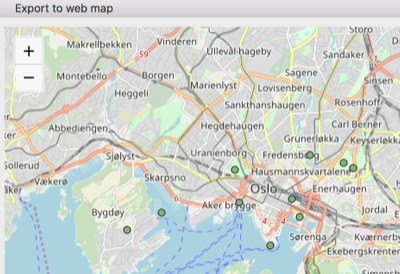

4. Under **Layers and Groups**, change the **Popup fields dropdowns**. I prefer to use **header label**, but the other options are inline label and None. **None** means the field **will appear** but without a label.

  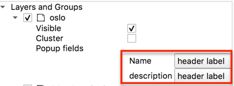

5. Click the **Appearance tab**, from the **Add layers list** dropdown choose one of the options. Choosing **collapsed** or **expanded** will **add a legend** to the map.

  

6. Make any other desired appearance changes. For example, and a **layer search and/or address search** to make the map more **web accessible**, measure tool, or have a custom map extent (how far someone can zoom in, out, and around). Click Update preview to see how any changes will look.

7. Click the **Export tab**.

8. Under Data export and to the right of Exporter, click the **three dots at the end of the line** to make sure the **output** goes to the **git repository folder**.

  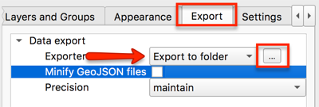

9. In the window that appears, **navigate** to the project's git repository and choose **Open**.

  

10. In the Export to web map window in QGIS, click **Export** at the bottom of the window.

  

11. When the map successfully exported, click OK. The log will show **Success** and the export file path if it is successful.

### Editing qgis2web index.html file
1. Navigate to the qgis2web folder in the git repository.

  

2. **Rename** the very long qgis2web folder name to **webapp**. This rename will be important for creating GitHub Pages at a later step. It is not necessary to use webapp specifically, but name it something short and memorable.

3. Open the folder, which is now named **webapp** in this tutorial, and double click the **index.html** file. The map will open in the default web browser. If for some reason the map is not appearing, right click the file and select Open with to open it with another web browser (e.g., Firefox instead of Chrome).

4. Keeping the map in the browser open, now, **right click the index.html file** and choose **Open with...** and select **Atom.app**.

  

    - As changes are made in the following steps, use command + S or File>Save to save edits.
    - Periodically refresh the browser window with the map that is open to see the changes.
    - If the for any reason the map disappears, troubleshoot the code in index.html file by using command + z to undo any previous changes (command + shift + z is redo). Check to see: was a colon or curly bracket accidentally deleted? If a variable was changed, were all variable names in the file updated and spelled correctly?


5. Within the head tags (`<head>`), delete line 6, or the line which begins `meta name="viewport"...`.

  

5. Copy and paste all of the following lines of code in its place or anywhere in the head `<head>` above the style tag `<style>`. Leaflet is meant to create mobile and web responsive maps, but these will help even more.

```js
<!-- Mobile meta tags to go in head-->
<meta name="HandheldFriendly" content="True">
<meta name="viewport" content="width=device-width, initial-scale=1.0, maximum-scale=1.0, user-scalable=no" />
<meta name="MobileOptimized" content="320"/>
<meta name="apple-mobile-web-app-capable" content="yes">
<meta http-equiv="cleartype" content="on">
```

  

6. In the style (`<style>`) section of the head, paste the following code in **line 23**, or after the closed curly bracket. **Note**: the line could be different if you did not paste the code from the previous step exactly as shown, so just look for the line directly above the closed style tag `</style>`. This code sets a min width and height for the map popups and adds scrolling capabilities. Change the min-width and min-height to meet your needs.

```js
<!--min width to go in head for #map style popup content-->
.leaflet-popup-content {
min-width: 200px;
min-height: 100px;
overflow-y: scroll;
}
```
  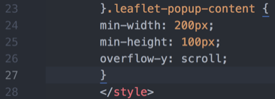

8. (Optional) Use command + F to find `marker`.

  

9. (Optional) Change `L.circleMarker` to `L.marker` to use the default Leaflet balloon markers instead of the one exported from QGIS. No need to delete any of the function `style_oslo_1_0`, Leaflet will now ignore it.

10. (Optional steps 10-15) Change the basemap to the Google Earth and Streets hybrid basemap.

11. Use command + F to find `var layer_OSMStandard_0`. This text may vary if you used a different basemap from the start.

12.  Delete the lines of code that are as follows:

```    js    
var layer_OSMStandard_0 = L.tileLayer('http://tile.openstreetmap.org/{z}/{x}/{y}.png', {
            opacity: 1.0,
            attribution: '<a href="https://www.openstreetmap.org/copyright">© OpenStreetMap contributors, CC-BY-SA</a>',
        });
        layer_OSMStandard_0;
```
13. Replace the code with the following:

``` js
var googleHybrid = L.tileLayer('https://{s}.google.com/vt/lyrs=s,h&x={x}&y={y}&z={z}',{
    maxZoom: 20,
    opacity: 1.0,
    subdomains:['mt0','mt1','mt2','mt3']
  });

googleHybrid;
```
14. Do a find and replace (command + F) for anything else that remains as `layer_OSMStandard_0` and replace it with `googleHybrid`

  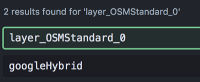

15. **Make your map secure**: Open **find and replace** (command + F) to find all instances of **http:** web addresses and replace it with **https:**. Only do this with web addresses and **NOT** any http instances within a variable name or tag). This is necessary so that the final map does not create an insecure connection on websites. If this is not done, the website the map is embedded will appear as insecure.

  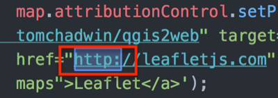

  


16. (Optional) Edit the legend to reflect the changes made such as the new basemap name and to remove the old marker image.

14. Use command + F to find the line that begins with `L.control.layers`.

  


15. Some changes that can be made:
  - If the places marker was changed, delete the image path that displays the old icon. You can add a new marker image by going into the webapp folder directory and adding it to the image folder.
  - Capitalize or change the name of the layer.
  - If the Google Hybrid basemap was used, replace the OSM Standard name in quotations with something like Google basemap


  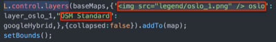


  

16. Make sure to continue to refresh the map in the browser to check the updates. Do the changes appear? If the map is not appearing at all, try to troubleshoot the code in the index.html file:
  - Was a colon or curly bracket accidentally deleted?
  - Were all variable names changed if choosing a new basemap?

### Push changes to GitHub
1. Open GitHub Desktop.

2. From the top left, make sure the current repository is the one with all of the data and leaflet files.

  

3. At the bottom, provide at least a summary for the changes and a description if desired, and click **Commit to master**.

  

4. In the top right, click **Push origin**.

  

### Create gh-pages
1. Once everything is uploaded, or *pushed*, to GitHub, click **Current Branch**, which is between Current Repository and Push origin. The current branch probably says master.

  

2. Click **New Branch**.

  

3. Name the new branch **gh-pages**. The branch **must** be named gh-pages. Naming a branch gh-pages tells GitHub that the branch should function as [GitHub Pages](https://help.github.com/en/articles/what-is-github-pages), GitHub's hosting services.

  

4. Click **Create Branch**.

5. Click **Publish branch**.

6. Now you can see the map at the branch's GitHub Pages site at YourGitHubAccount.github.io/gitRepositoryName/webapp.
  - YourGitHubAccount = replace with your GitHub account named
  - .github.io/ = keep as is
  - gitRepositoryName = input the git repository name such as 2019_oslo
  - webapp = this is the folder that originally had the long qgis2web title and was changed to webapp in the section **Editing qgis2web index.html file**
  - For example a gh-pages link would like [havemaps.github.io/2019_oslo/webapp](https://havemaps.github.io/2019_oslo/webapp/#13/59.9096/10.7292)

## Integrating with a website
The simplest way to embed the Leaflet map into a website is with an iframe. This may or may not be possible depending on the content management system being used.  

As of May 2019, iframe html tags `<iframe>` do not seem to be compatible with the most recent version of free, personal instances of WordPress. The best reason I could find was "due to security reasons"

Iframe html tags (e.g., `<iframe src=" ">`) work with some older versions and instances of WordPress.

If you want to integrate the exported qgis2web map with a WordPress that does not allow the iframe html tags there are a couple ways to do it:

1. A **WordPress business plan** to access the [iframe plugin](https://wordpress.org/plugins/iframe/).
2. A **hosting service** that allows you to upload html pages in the WordPress source code.
3. Work with the **index.html** file from qgis2web start adding your own free text and html to create a functional page. Then, link to the gh-pages from the website.

### Using the iframe html tag
This option may work with some self-hosted websites or institutionally hosted WordPress accounts.

1. Create a new page or post in the content mamangement system. This example uses WordPress.

2.  Using the **classic editor**, choose **Text** instead of Visual.

3. Use the html iframe tag: `<iframe src=" " width=" " height=" "></iframe>`

4. Between the **iframe src= quotation marks**, paste the link to the **GitHub Pages** (gh-pages branch) for the project repository. It should look like https://YourGitHubAccount.github.io/repoName/webapp.

5. Between the width and height quotations, set the width and height of the map. For example, the final html might look like: `<iframe src="https://havemaps.github.io/2019_oslo/webapp" width="800" height="400"></iframe>`. Also try adding scrolling="no". This may not work for all content management systems.

6. Click Preview to check out how it appears.

### WordPress iframe plugin

1. Add the iFrame plugin to a WordPress website you administer that has a business plan or higher.

1. Create a new page or post.

2. Using the blocks editor, choose **Shortcode** as the widget type.

  

3. Type `[iframe src=" " scrolling="no"]`. If you would prefer to have scroll bars on the map, type `scrolling="yes"` or do not use the `scrolling=` at all.

4. Between the **iframe src= quotation marks**, paste the link to the **GitHub Pages** hosted site for the project repository.
  - The link should look like https://YourGitHubAccount.github.io/repoName/webapp. This link is different from just linking to the project repository.
  - The final shortcode should look similar to this: `[iframe src="https://havemaps.github.io/2019_oslo/webapp" scrolling="no"]`


5. Click Preview to check out how it appears.

## Map text description

Maps are great! However, they may not be accessible to all users for reasons ranging from low-internet connectivity, incompatability with a screenreader, vision impairment, and neurological differences that make interpreting complex images difficult.

Below the map, include a thorough text description. Drafting the text descriptions in a spreadsheet from the start helps with the text description process because it makes it easy to directly copy text into the post editor. If the places were not listed in any particular order, make an effort to arrange the text descriptions in a way that will make narrative sense.

For example, if the map is of places, make an effort to provide a narrative or list that describes the places in the order they were visited. A thorough text description aims to give an equivalent experience to all users.

Find live examples of map text descriptions on [my About page](https://havemapswilltravel.com/about) (click Expand text description) and all of my posts such as [Musandam 2019](https://havemapswilltravel.com/2019/05/15/20190404-musandam/).
