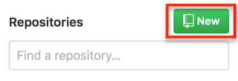
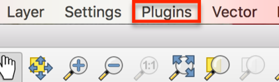
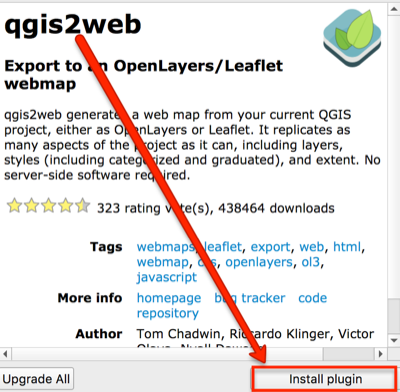
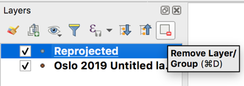
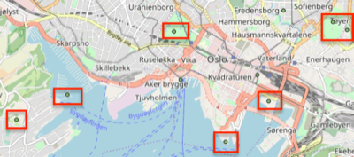
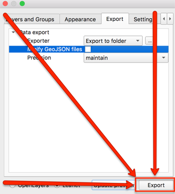
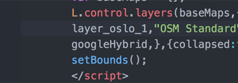

# Creating and hosting Leaflet maps with qgis2web and GitHub

## Getting started

### Download dependencies
This tutorial was made using Mac iOS High Sierra v 10.13.6. The following software is used and should be installed before beginning:

- [QGIS3](https://qgis.org/en/site/forusers/download.html)--[video for Mac install assistance]([watch this vide0]https://www.youtube.com/watch?v=908NyL7roFs)
- [GitHub account](https://github.com/)
- [GitHub Desktop](https://desktop.github.com/)
- [Atom text editor](https://atom.io/)
- [Firefox](https://www.mozilla.org/en-US/firefox/new/) and/or [Chrome](https://www.google.com/chrome/) web browsers--I like viewing and testing the map in multiple browsers
- [Google account](https://support.google.com/accounts/answer/27441?hl=en) (i.e., Gmail account)
- Google Sheets, Excel, or another spreadsheet editor
- Access to command line such as Terminal (MacOS)
- Optional: website. If using WordPress, a business account and iFrame plugin are required.

## Create a GitHub repository
1. Go to [github.com](https://github.com/) and login. Create a new account if needed.

2. Next to **Repositories** click **New** to create a new repository. Provide a name at a minimum. Fill out the information. A license is not required, but I Like to use [Creative Commons](https://creativecommons.org/)

  

3. Click **Set up in Desktop**. If a window appears in the browser asking how to open it, choose the option **Open GitHub Desktop.app**.

  

4. Make sure the local desktop path looks correct, i.e., somewhere you will remember, and click **clone**.

## List places and draft text
While I am travelling, I make sure to write down the names of the places that I visit: restaurants, sites, etc.

1. List the places to display on a map in spreadsheet. This documentation shows Google Sheets. If using an Excel or Numbers file, this should be saved in the git repository created in the previous section.

2. Once the places are listed, in the next column write the content to be displayed on the map when the place is clicked in the final map. This text will also be used in the text description to show below the map.

## Image processing
### Add images to git repository and resize images
1. Load photos to computer. I take photos with an iPhone, so I use AirDrop.

2. If not done previously, create a new folder in the git repository called images.

3. Copy photos into git repository file titled images. Make sure to **COPY** the images or have a backup because these images will be resized.

4. If desired, rename the photos to something more descriptive and memorable.

5. Open the Terminal. If you are not sure where Terminal is, type Terminal into Mac's spotlight.

  

6. Change the directory using the command `cd` to the git repository with the images. For example:

```
cd git
cd 2019_oslo
cd images
```
  Or use a relative path like:
```
cd git/2019_oslo/images
```
7. Once Terminal shows that it is in the directory for the images, use the following code to resize the images to 300 pixels, or the desired resize:

```
sips -Z 300 *.jpg
```
  In the above code the **300 is the pixel width**--the height is auto-scaled. The * (asterisk) represents choosing **all files** with the file type .jpg. **The code above is case sensitive.** Meaning, sometimes I need to run this twice because the file type of some images is **.JPG** and not **.jpg**. This also works for .png, .tiff, etc. I do not suggest using anything larger than 300 pixels in the leaflet popup--these maps are not exactly the best platform for showcasing high-quality images.

8. Open GitHub Desktop

  - If not already selected, select the project repository.
  - Notice the relative path for all images added are listed in Changes.
  - I like to delete or set up a .gitignore for the .DS_Store file because it is not necessary. Right click the .DS_Store file for either of these options.


9. At the bottom of the column on the left, type in a summary such as initial commit. If working with others on this project, add a more detailed description.

10. Click **Commit to master**.

  

11. This is probably the first thing added to the repository, so click **Publish branch** at the top of the window. Depending on how many images, this can take a few moments. If it is taking a very long time, it may be because the images were not resized.

    

12. Go to [GitHub.com](https://github.com) and view the repository.

13. Click the folder for images.

14. Click on an individual image link in the folder.

15. Right click the image, and choose copy image address.

  


16. Open the spreadsheet with the place names and descriptions.

17. Paste the image link into an empty column in the row the place described. If using a new spreadsheet, place it  **A1**.

  

18. Keep copying and pasting image addresses in a down the column or next to any place with an image for all remaining images. There are many ways to get the image links into the spreadsheet. For example, you can also change the image name in the link, or if there are more than 20, finding an automated way to capture addresses may be helpful.

19. In an empty cell in the rows with images, create alt text to be read by screen readers or to display when the image does not appear.

  

20. In the next empty cell in the row type `=CONCATENATE`

21. Within the parentheses type: ``""``

22. Copy this formula down the column.

23. Copy the column and paste as values in the next empty column. Use command + shift + v to paste as values, or right click/control click and choose Paste Special>Paste Values Only

24. Use find and replace for the + or special character used as a placeholder for the quotation mark in the concatenate function.
  - Press command or ctrl + F
  - Press the three stacked dots at the right of the window for more options.
  - Type + in Find and " in Replace with. Then, press Done.

  

  

## Create geospatial data

### Options for geocoding
There are any number of ways to get coordinates and organize the geospatial data. I usually start by creating a map with [mymaps.google.com](https://mymaps.google.com), which the following steps will demonstrate. Sometimes the places I visit might not have a precise address or indexed location (e.g., campsites, sailing locations), so I really like being able to identify the location with the imagery.

**However**, if you have **more than 20 places** to map that are likely to be on Google under known place names, use [Geocode by Awesome Table](https://support.awesome-table.com/hc/en-us/sections/360000012309-Geocode) on the Google Sheet used in the previous sections, download as a .csv, and either add it to MyMaps to check the geocoding or add it directly to QGIS. If anything appears incorrectly in MyMaps, manually move any that are in the incorrect place and/or add any places that did not appear at all.

If you are not using Google Sheets or if you do not want to use the Geocode add-on, there are many manual and batch ways to get latitude and longitude:
  - [latlong.net](https://www.latlong.net/)
  - [batchgeo.com](https://batchgeo.com/)
  - [geocode.localfocus.nl](https://geocode.localfocus.nl/)

### Add places to MyMaps
1. Go to [mymaps.google.com](https://mymaps.google.com). If you do not have a [Google account](https://accounts.google.com/SignUp), create one to save projects.

2. Click the red circle with the plus sign in the bottom right to create a new map.

3. Search for a place traveled in the search bar by typing it in or copying it from the spreadsheet and pressing enter/return or clicking the magnifying glass button.

  

4. If the place appears in the correct place, click +Add to map in the bottom of the pop up box.
If the place does **not appear**, zoom around the map to try to find the approximate location, and then, click the balloon icon below the search bar to manually add a marker.
  - Repeat either process for all places.
  - Keep all points in one layer.


5. Next to the layer title, which is probably **Untitled layer**, click the three stacked dots and Open data table.

  

6. At this point, it is possible to add new columns and include any text descriptions and data desired.
  - This is when I like to copy the text description and image links from the Google Sheet into the table.
  - I usually add the image link in the description, but some may prefer to have it in its own column, especially if every place has an image.
  - When adding image links to the description column, add a manual line break in the cell between the text and link using shift + enter/return. Just using enter/return will select the next cell.
  - To add an image link copy what is from the spreadsheet in the previous sections or create a new one using something like: ``
  - **Image links will appear as text NOT an image in MyMaps**
  - If preferred, add categories for the places, such as site, lodging, food.
  - To capitalize the column titles, click the column title dropdown and choose Duplicate. In the popup, change the title to the desired word or phrase. **Single words are preferable**.
  - Organizing the data table usually comes down to how you want people to consume your content.

### Export KML
1. To the right of the map title, click the three stacked dots.

  

2. Choose Export to KML/KMZ.

  

3. In the pop up, click the radio button for **Export as KML instead of KMZ.**

  

4. Click **Download**.

5. Add the downloaded .kml file to the git repository folder on the desktop.

    

## Working with QGIS
If downloading QGIS3 for the first time and using a Mac, [watch this video](https://www.youtube.com/watch?v=908NyL7roFs). It is not a one-click install on Mac.

### Saving a project

1. Open QGIS.

2. Use command + S, click the floppy disc icon in the top left of QGIS, **OR** click File>Save.

3. Navigate to the git repository for this project.

4. Name the QGIS project file.

5. Make sure the file type is **.qgz**.

    

6. While working in QGIS, periodically save the project. Saving the project makes sure layer styles and all other project properties, including qgis2web properties, are saved if the project needs to be paused or when it is shared with others.

### Installing QGIS Plugins
1. Open QGIS.

2. Click **Plugins** from the top menu.

      

3. Click manage and install plugins.

      

4. Make sure **All** is selected from the left side of the popup window, and search for: **qgis2web**.

      

5. Select the result **qgis2web** so that the information about the plugin appears on the right side of the window.

5. Below the plugin description, click **Install plugin**.

      

6. In the search results, make sure the box next to it is checked so that it appears.

      

7. Search for **QuickMapServices**, and click **Install Plugin**. Make sure the box next to it is checked, too.

      

8. When both plugins are installed, close the plugins window. Not sure if they are installed? Click the Installed option in the Plugins window.

9. From the **top menu**, click **Web**. Qgis2Web and QuickMapServices should both appear there. If not, quit QGIS and reopen it. If it still does not appear, go back to the manage and install plugins window and check that these are listed in Installed Plugins. If the plugins are listed there, make sure the box to the left of the plugin is checked.

      

### Create Projected GeoJSON
Now, the data from MyMaps needs to be reprojected to match the OpenStreetMap projection: EPSG 3857. This step is not necessary if you are not using a basemap or have created your own. However, if using any basemap from the web such as Google or options from MapBox, then it is **required** to reproject the data.
1. Open QGIS if it was closed after the last section.

2. Drag the downloaded KML with the data for this project into the layers panel. If the layers panel is not open, from the top menu click View>Panels>Layers.

      

3. Open **Processing Toolbox** panel. Do this by clicking the gear icon, of from the top menu, **View>Panels>Processing Toolbox**.

4. Search for reproject and select it. The correct tool is **Reproject layer** under Vector general.

  

5. Double click reproject layer.

6. For the parameters in the window that appears:
  - Input layer should be the kml from MyMaps. Search for it if necessary

  - The Target CRS is **EPSG:3857**. If it is not in the dropdown, click the globe icon and search 3857. This projection appears under Projected Coordinate Systems>Mercator>WGS 84 / Pseudo-Mercator, Authority ID EPSG:3857.

  - For Reprojected, click the three dots at the end, and choose Save to File.

  - Change the output file type to .geojson, give it a name, and choose the Git repository for this project as the save path.

  

7. When the screen looks like the above image, click **Run** in the bottom right of the Reproject Layer window.

7. Close the Reproject Layer window when the Log tab shows the layer was reprojected successfully by displaying the message "Algorithm 'Reproject Layere' finished"

8. Remove all layers from the layers panel by right clicking them and choosing Remove Layer or highlighting at clicking the Remove icon in the Layers panel.

  

9. Add the reprojected layer by dragging it into the Layers panel. The layer **should** be in the git repository--if it is not, move it there before placing in the layers panel. This is the only item that should appear in the Layers panel! Additionally, make sure you can see the points in the QGIS workspace area.

  

10. Click Web>QuickMapServices>OpenStreetMap>OSMStandard.

  

11. Do the places look correct on top of the OpenStreetMap basemap?

  

### Edit the data
KML files come with a lot of extra columns, and this carried over to the geojson. Let's fix that and more!

1. Make sure QGIS is open and the reprojected geojson is in the Layers Panel.

2. Right click the layer, and choose open attribute table.

  

3. To edit the attribute table, click the pencil icon in the top left of the attribute table or use Command + E.

  

4. To start deleting empty columns, click the icon for removing a column.
**Note**: Deleting a column is permanent. You may want to copy the geojson if this is your first time just in case.

  

5. In the window that appears, click the following columns to select them for deletion:
  - timestamp
  - begin
  - end
  - altitudeMode
  - tessellate
  - extrude
  - visbility
  - drawOrder
  - icon

    

6. Once all the necessary columns are highlighted, click OK.

7. If the correct columns were deleted, click the floppy disc icon in the top left to save edits.

  

8. While in the attribute table, make any other content edits.

9. Click the pencil icon in the top left again when finished. Make sure to save edits.

### Styling the map
You may wish to style the points or categorize the data on the map. However, you can also leave the default point marker and change it to a leaflet style, which is demonstrated in a later step.

### Using qgis2web to export Leaflet code
The point of using qgis2web instead of immediately starting with Leaflet is that qgis2web can output complex and correct javascript for pop-ups, legends, and other map options without needing to know the code. Then, it is very simple to go into the qgis2web's html file and other outputs to make customizations and additions for basemaps, markers, etc.

1. From the top toolbar in QGIS, click Web>qgis2web>create web map.

  

2. In the bottom left of the window that appears, click the radio button for Leaflet, and if needed, click Update preview.

  

3. Make sure the map appears in the right side of the Export to web map window. If nothing appears or only one layer appears, there are two simple possibilities: 1) Leaflet is not selected or 2) the projection is probably incorrect--return to that step.

  

4. (Optional) Under Layers and Groups, change the Popup fields dropdowns to header label.

  

5. Click the Appearance tab, from the Add layers list dropdown choose one of the options. This will add a legend to the map.

  

6. Make any other desired appearance changes. For example, and a layer search, measure tool, or have a custom map extent (how far someone can zoom in, out, and around). Click Update preview to see how any changes will look.

7. Click the Export tab.

8. Click the three dots to the right of Exporter to make sure the output goes to the git repository.

  

9. Navigate to the git repository and choose **Open**.

  

10. In the Export to web map window in QGIS, click Export at the bottom of the window.

  

11. When the map successfully exported, click OK. The log will show **Success** and the export file path if it is successful.

### Editing qgis2web index.html file
1. Navigate to the qgis2web export in the git repository.

  

2. Rename the qgis2web folder to **webapp**. This rename will be important at a later step.

3. Open the folder, which is now named webapp in this tutorial, and double click the **index.html** file. The map will open in the default web browser. If for some reason the map is not appearing, right click the file and select choose with to open it with another web browser (e.g., Firefox instead of Chrome).

4. Keeping the map in the browser open, **right click the index.html file** and choose **Open with...** and select **Atom.app**.

  

    - As changes are made in the following steps, use command + S or File>Save to save edits.

    - Periodically refresh the browser window with the map that is open to see the changes.

    - If the for any reason the map disappears, troubleshoot the code in index.html file by using command + z to undo any previous changes. Check to see: was a colon or curly bracket accidentally deleted? Were all variable names changed and spelled correctly?

4. Within the head tags `<head>`, delete line 6, which begins `meta name="viewport"...`.

  

5. Copy and paste all of the following lines of code in its place or anywhere in the head `<head>` above the style tag `<style>`. Leaflet is a meant to create mobile and web responsive maps, but these will help even more.

```js
<!-- Mobile meta tags to go in head-->
<meta name="HandheldFriendly" content="True">
<meta name="viewport" content="width=device-width, initial-scale=1.0, maximum-scale=1.0, user-scalable=no" />
<meta name="MobileOptimized" content="320"/>
<meta name="apple-mobile-web-app-capable" content="yes">
<meta http-equiv="cleartype" content="on">
```

  

6. In style `<style>` section of the head, paste the following code in **line 23** after the closed curly bracket. **Note**: the line could be different if you did not paste the code from the previous step exactly as shown, so just look for the line directly above the closed style tag `</style>`. This code sets a min width and height for the map popups and adds scrolling capabilities. Change the min-width and min-height to meet your needs.

```js
<!--min width to go in head for #map style popup content-->
.leaflet-popup-content {
min-width: 200px;
min-height: 100px;
overflow-y: scroll;
}
```
  

8. (Optional) Delete the custom marker code to use the default Leaflet marker.

9. Use command + F to find `marker`.

  

10. Change `L.circleMarker` to `L.marker` to use the default Leaflet balloon markers instead of the one exported from QGIS. No need to delete any of the function `style_oslo_1_0`, Leaflet will now ignore it.

9. (Optional steps 9-12) Change the basemap to the Google Earth and Streets hybrid basemap.

9. Use command + F to find `var layer_OSMStandard_0`.

10.  Delete the lines of code that are as follows:

```    js    
var layer_OSMStandard_0 = L.tileLayer('http://tile.openstreetmap.org/{z}/{x}/{y}.png', {
            opacity: 1.0,
            attribution: '<a href="https://www.openstreetmap.org/copyright">© OpenStreetMap contributors, CC-BY-SA</a>',
        });
        layer_OSMStandard_0;
```
11. Replace the code with the following:

``` js
var googleHybrid = L.tileLayer('https://{s}.google.com/vt/lyrs=s,h&x={x}&y={y}&z={z}',{
    maxZoom: 20,
    opacity: 1.0,
    subdomains:['mt0','mt1','mt2','mt3']
  });

googleHybrid;
```
12. Do a find and replace (command + F) for anything else that remains as `layer_OSMStandard_0` and replace it with `googleHybrid`

  

13. (Optional) Edit the legend to reflect the changes made such as the new basemap name and to remove the old marker image.

7. Open **find and replace** (command + F) to find all instances of **http:** web addresses and replace it with **https:**. Only do this wil web addresses and NOT any http instances within a variable name or tag). This is necessary so that the final map does not create an insecure connection on websites. If this is not done, the website the map is embedded will appear as insecure.

  

  

14. Use command + F to find the line `L.control.layers`.

  

15. If the places marker was changed, delete the image path. Also, capitalize or change the name of the layer. If the Google Hybrid basemap was used, replace the OSM Standard name in quotations with something like Google basemap

  

  

16. Back in the git repository with the webapp file, double click the index.html file to open it in a web browser. Do the changes appear? If the map is not appearing at all, try to troubleshoot the code in the index.html file: was a colon or curly bracket accidentally deleted? Were all variable names changed if choosing a new basemap?

### Push changes to GitHub
1. Open GitHub Desktop.

2. From the top left, make sure the current repository is the one with all of the data and leaflet files.

  

3. At the bottom, provide at least a summary for the changes and a description if desired, and click **Commit to master**.

  

4. In the top right, click **Push origin**.

  

### Create gh-pages
1. Once everything is uploaded, or *pushed*, to GitHub, click **Current Branch**, which is between Current Repository and Push origin. The current branch probably says master.

  

2. Click **New Branch**.

  

3. Name the new branch **gh-pages**. The branch **must** be named gh-pages. Naming a branch gh-pages tells GitHub that the branch should function as [GitHub Pages](https://help.github.com/en/articles/what-is-github-pages), GitHub's hosting services.

  

4. Click Create Branch.

5. Click Publish branch.

6. Now you can see the map at the branch's GitHub Pages site at YourGitHubAccount.github.io/gitRepositoryName/webapp.
  - YourGitHubAccount = replace with your GitHub account named
  - .github.io/ = keep as is
  - gitRepositoryName = input the git repository name
  - webapp = this is the file that originally had the long qgis2web title and was changed to webapp in the section **Editing qgis2web index.html file**

For example, [havemaps.github.io/2019_oslo/webapp](https://havemaps.github.io/2019_oslo/webapp/#13/59.9096/10.7292)

## Integrating with a website
The simplest way to embed the Leaflet map into a website is with an iframe. This may or may not be possible depending on the content management system being used.  

Iframe html tags <iframe> do not seem to be compatible with  free, personal instances of WordPress as of May 2019. The best reason I could find was "due to security reasons"

Iframe html tags (e.g., `<iframe src=" ">`) work with some university institutional instances of WordPress.

If you want to integrate the exported qgis2web map with a personal or business WordPress that does not allow the iframe html tags there are a couple ways to do it:

1. A **business plan** is required to access the [iframe plugin](https://wordpress.org/plugins/iframe/).
2. A **hosting service** that allows you to upload html pages in the WordPress source code.

### Using the iframe html tag
This option may work with some self-hosted websites or institutionally hosted WordPress accounts.

1. Create a new page or post in the content mamangement system. This example uses WordPress.

2.  Using the **classic editor**, choose **Text** instead of Visual.

3. Use the html iframe tag: `<iframe src=" " width=" " height=" "></iframe>`

4. Between the **iframe src= quotation marks**, paste the link to the **GitHub Pages** (gh-pages branch) for the project repository. It should look like https://YourGitHubAccount.github.io/repoName/webapp.

5. Between the width and height quotations, set the width and height of the map. For example, the final html might look like: `<iframe src="https://havemaps.github.io/2019_oslo/webapp" width="800" height="400"></iframe>`. Also try adding scrolling="no". This may not work for all content management systems.

6. Click Preview to check out how it appears.

### WordPress iframe plugin

1. Create a new page or post.

2. Using the blocks editor, choose **Shortcode** as the widget type.

  

3. Type `[iframe src=" " scrolling="no"]`. If you would prefer to have scroll bars on the map, type `scrolling="yes"` or do not use the `scrolling=` at all.

4. Between the **iframe src= quotation marks**, paste the link to the **GitHub Pages** (gh-pages branch) for the project repository. It should look like https://YourGitHubAccount.github.io/repoName/webapp

5. `[iframe src="https://havemaps.github.io/2019_oslo/webapp" scrolling="no"]`

5. Click Preview to check out how it appears.

## Map text description

Maps are great! However, they may not be accessible to all online users. Below the map, include a thorough text description. A thorough text description gives an equivalent experience to all users.

For example, if the map is of places, make an effort to provide a narrative or list that describes the places as they are in the map.
Starting in a spreadsheet helps with the text description process because it makes it easy to directly copy column information into the post editor. Make an effort to arrange the place descriptions in a way that will make narrative sense to the reader.

Find live examples of map text descriptions on [my About page](https://havemapswilltravel.com/about) (click Expand text description) and all of my posts such as [Musandam 2019](https://havemapswilltravel.com/2019/05/15/20190404-musandam/).
