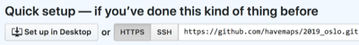
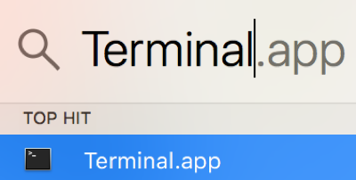
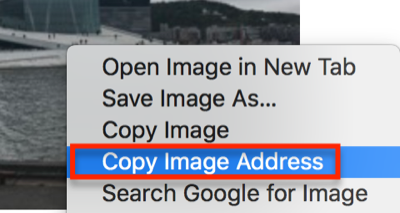
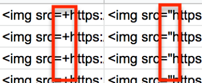
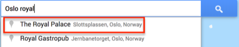
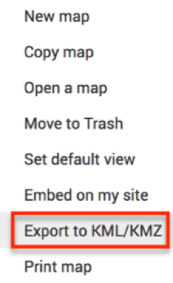

# Getting Started & Creating Geospatial Data

## Getting started

### Download dependencies
This tutorial was made using Mac iOS High Sierra v 10.13.6. The following software is used and should be installed before beginning:

- [QGIS3](https://qgis.org/en/site/forusers/download.html)--[video for Mac install assistance](https://www.youtube.com/watch?v=908NyL7roFs)
- [GitHub account](https://github.com/)
- [GitHub Desktop](https://desktop.github.com/)
- [Atom text editor](https://atom.io/)
- [Firefox](https://www.mozilla.org/en-US/firefox/new/) and/or [Chrome](https://www.google.com/chrome/) web browsers--I like viewing and testing the map in multiple browsers
- [Google account](https://support.google.com/accounts/answer/27441?hl=en) (i.e., Gmail account)
- Google Sheets, Excel, or another spreadsheet editor
- Access to command line such as Terminal (MacOS)
- Optional: website. If using WordPress, a business account and iFrame plugin are required.

## Create a GitHub repository
1. Go to [github.com](https://github.com/) and login. Create a new account if needed.

2. Next to **Repositories** click **New** to create a new repository. Provide a name at a minimum. Fill out the information. A license is not required, but I Like to use [Creative Commons](https://creativecommons.org/)

  

3. Click **Set up in Desktop**. If a window appears in the browser asking how to open it, choose the option **Open GitHub Desktop.app**.

  

4. Make sure the local desktop path looks correct, i.e., somewhere you will remember, and click **clone**.

## List places and draft text
While I am travelling, I make sure to write down the names of the places that I visit: restaurants, sites, etc.

1. List the places to display on a map in spreadsheet. This documentation shows Google Sheets. If using an Excel or Numbers file, this should be saved in the git repository created in the previous section.

2. Once the places are listed, in the next column write the content to be displayed on the map when the place is clicked in the final map. This text will also be used in the text description to show below the map.

## Image processing
### Add images to git repository and resize images
1. Load photos to computer. I take photos with an iPhone, so I use AirDrop.

2. If not done previously, create a new folder in the git repository called images.

3. Copy photos into git repository file titled images. Make sure to **COPY** the images or have a backup because these images will be resized.

4. If desired, rename the photos to something more descriptive and memorable.

5. Open the Terminal. If you are not sure where Terminal is, type Terminal into Mac's spotlight.

  

6. Change the directory using the command `cd` to the git repository with the images. For example:

```
cd git
cd 2019_oslo
cd images
```
  Or use a relative path like:
```
cd git/2019_oslo/images
```
7. Once Terminal shows that it is in the directory for the images, use the following code to resize the images to 300 pixels, or the desired resize:

```
sips -Z 300 *.jpg
```
  In the above code the **300 is the pixel width**--the height is auto-scaled. The * (asterisk) represents choosing **all files** with the file type .jpg. **The code above is case sensitive.** Meaning, sometimes I need to run this twice because the file type of some images is **.JPG** and not **.jpg**. This also works for .png, .tiff, etc. I do not suggest using anything larger than 300 pixels in the leaflet popup--these maps are not exactly the best platform for showcasing high-quality images.

8. Open GitHub Desktop

  - If not already selected, select the project repository.
  - Notice the relative path for all images added are listed in Changes.
  - I like to delete or set up a .gitignore for the .DS_Store file because it is not necessary. Right click the .DS_Store file for either of these options.


9. At the bottom of the column on the left, type in a summary such as initial commit. If working with others on this project, add a more detailed description.

10. Click **Commit to master**.

  

11. This is probably the first thing added to the repository, so click **Publish branch** at the top of the window. Depending on how many images, this can take a few moments. If it is taking a very long time, it may be because the images were not resized.

    

12. Go to [GitHub.com](https://github.com) and view the repository.

13. Click the folder for images.

14. Click on an individual image link in the folder.

15. Right click the image, and choose copy image address.

  


16. Open the spreadsheet with the place names and descriptions.

17. Paste the image link into an empty column in the row the place described. If using a new spreadsheet, place it  **A1**.

  

18. Keep copying and pasting image addresses in a down the column or next to any place with an image for all remaining images. There are many ways to get the image links into the spreadsheet. For example, you can also change the image name in the link, or if there are more than 20, finding an automated way to capture addresses may be helpful.

19. In an empty cell in the rows with images, create alt text to be read by screen readers or to display when the image does not appear.

  

20. In the next empty cell in the row type `=CONCATENATE`

21. Within the parentheses type: ``""``

22. Copy this formula down the column.

23. Copy the column and paste as values in the next empty column. Use command + shift + v to paste as values, or right click/control click and choose Paste Special>Paste Values Only

24. Use find and replace for the + or special character used as a placeholder for the quotation mark in the concatenate function.
  - Press command or ctrl + F
  - Press the three stacked dots at the right of the window for more options.
  - Type + in Find and " in Replace with. Then, press Done.

  

  

## Create geospatial data

### Options for geocoding
There are any number of ways to get coordinates and organize the geospatial data. I usually start by creating a map with [mymaps.google.com](https://mymaps.google.com), which the following steps will demonstrate. Sometimes the places I visit might not have a precise address or indexed location (e.g., campsites, sailing locations), so I really like being able to identify the location with the imagery.

**However**, if you have **more than 20 places** to map that are likely to be on Google under known place names, use [Geocode by Awesome Table](https://support.awesome-table.com/hc/en-us/sections/360000012309-Geocode) on the Google Sheet used in the previous sections, download as a .csv, and either add it to MyMaps to check the geocoding or add it directly to QGIS. If anything appears incorrectly in MyMaps, manually move any that are in the incorrect place and/or add any places that did not appear at all.

If you are not using Google Sheets or if you do not want to use the Geocode add-on, there are many manual and batch ways to get latitude and longitude:
  - [latlong.net](https://www.latlong.net/)
  - [batchgeo.com](https://batchgeo.com/)
  - [geocode.localfocus.nl](https://geocode.localfocus.nl/)

### Add places to MyMaps
1. Go to [mymaps.google.com](https://mymaps.google.com). If you do not have a [Google account](https://accounts.google.com/SignUp), create one to save projects.

2. Click the red circle with the plus sign in the bottom right to create a new map.

3. Search for a place traveled in the search bar by typing it in or copying it from the spreadsheet and pressing enter/return or clicking the magnifying glass button.

  

4. If the place appears in the correct place, click +Add to map in the bottom of the pop up box.
If the place does **not appear**, zoom around the map to try to find the approximate location, and then, click the balloon icon below the search bar to manually add a marker.
  - Repeat either process for all places.
  - Keep all points in one layer.


5. Next to the layer title, which is probably **Untitled layer**, click the three stacked dots and Open data table.

  

6. At this point, it is possible to add new columns and include any text descriptions and data desired.
  - This is when I like to copy the text description and image links from the Google Sheet into the table.
  - I usually add the image link in the description, but some may prefer to have it in its own column, especially if every place has an image.
  - When adding image links to the description column, add a manual line break in the cell between the text and link using shift + enter/return. Just using enter/return will select the next cell.
  - To add an image link copy what is from the spreadsheet in the previous sections or create a new one using something like: ``
  - **Image links will appear as text NOT an image in MyMaps**
  - If preferred, add categories for the places, such as site, lodging, food.
  - To capitalize the column titles, click the column title dropdown and choose Duplicate. In the popup, change the title to the desired word or phrase. **Single words are preferable**.
  - Organizing the data table usually comes down to how you want people to consume your content.

### Export KML
1. To the right of the map title, click the three stacked dots.

  

2. Choose Export to KML/KMZ.

  

3. In the pop up, click the radio button for **Export as KML instead of KMZ.**

  

4. Click **Download**.

5. Add the downloaded .kml file to the git repository folder on the desktop.

    
