# Working with QGIS, qgis2web, and Leaflet

## Working with QGIS
If downloading QGIS3 for the first time and using a Mac, [watch this video](https://www.youtube.com/watch?v=908NyL7roFs). It is not a one-click install on Mac.

### Saving a project

1. Open QGIS.

2. Use command + S, click the floppy disc icon in the top left of QGIS, **OR** click File>Save.

3. Navigate to the git repository for this project.

4. Name the QGIS project file.

5. Make sure the file type is **.qgz**.

    

6. While working in QGIS, periodically save the project. Saving the project makes sure layer styles and all other project properties, including qgis2web properties, are saved if the project needs to be paused or when it is shared with others.

### Installing QGIS Plugins
1. Open QGIS.

2. Click **Plugins** from the top menu.

      

3. Click manage and install plugins.

      

4. Make sure **All** is selected from the left side of the popup window, and search for: **qgis2web**.

      

5. Select the result **qgis2web** so that the information about the plugin appears on the right side of the window.

5. Below the plugin description, click **Install plugin**.

      

6. In the search results, make sure the box next to it is checked so that it appears.

      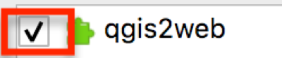

7. Search for **QuickMapServices**, and click **Install Plugin**. Make sure the box next to it is checked, too.

      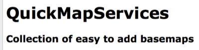

8. When both plugins are installed, close the plugins window. Not sure if they are installed? Click the Installed option in the Plugins window.

9. From the **top menu**, click **Web**. Qgis2Web and QuickMapServices should both appear there. If not, quit QGIS and reopen it. If it still does not appear, go back to the manage and install plugins window and check that these are listed in Installed Plugins. If the plugins are listed there, make sure the box to the left of the plugin is checked.

      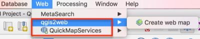

### Create Projected GeoJSON
Now, the data from MyMaps needs to be reprojected to match the OpenStreetMap projection: EPSG 3857. This step is not necessary if you are not using a basemap or have created your own. However, if using any basemap from the web such as Google or options from MapBox, then it is **required** to reproject the data.
1. Open QGIS if it was closed after the last section.

2. Drag the downloaded KML with the data for this project into the layers panel. If the layers panel is not open, from the top menu click View>Panels>Layers.

      

3. Open **Processing Toolbox** panel. Do this by clicking the gear icon, of from the top menu, **View>Panels>Processing Toolbox**.

4. Search for reproject and select it. The correct tool is **Reproject layer** under Vector general.

  

5. Double click reproject layer.

6. For the parameters in the window that appears:
  - Input layer should be the kml from MyMaps. Search for it if necessary

  - The Target CRS is **EPSG:3857**. If it is not in the dropdown, click the globe icon and search 3857. This projection appears under Projected Coordinate Systems>Mercator>WGS 84 / Pseudo-Mercator, Authority ID EPSG:3857.

  - For Reprojected, click the three dots at the end, and choose Save to File.

  - Change the output file type to .geojson, give it a name, and choose the Git repository for this project as the save path.

  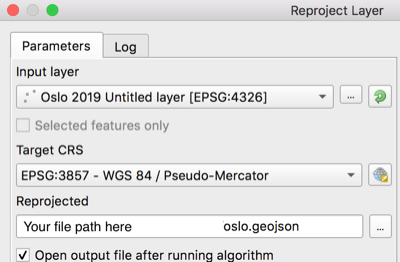

7. When the screen looks like the above image, click **Run** in the bottom right of the Reproject Layer window.

7. Close the Reproject Layer window when the Log tab shows the layer was reprojected successfully by displaying the message "Algorithm 'Reproject Layere' finished"

8. Remove all layers from the layers panel by right clicking them and choosing Remove Layer or highlighting at clicking the Remove icon in the Layers panel.

  

9. Add the reprojected layer by dragging it into the Layers panel. The layer **should** be in the git repository--if it is not, move it there before placing in the layers panel. This is the only item that should appear in the Layers panel! Additionally, make sure you can see the points in the QGIS workspace area.

  

10. Click Web>QuickMapServices>OpenStreetMap>OSMStandard.

  

11. Do the places look correct on top of the OpenStreetMap basemap?

  

### Edit the data
KML files come with a lot of extra columns, and this carried over to the geojson. Let's fix that and more!

1. Make sure QGIS is open and the reprojected geojson is in the Layers Panel.

2. Right click the layer, and choose open attribute table.

  

3. To edit the attribute table, click the pencil icon in the top left of the attribute table or use Command + E.

  

4. To start deleting empty columns, click the icon for removing a column.
**Note**: Deleting a column is permanent. You may want to copy the geojson if this is your first time just in case.

  

5. In the window that appears, click the following columns to select them for deletion:
  - timestamp
  - begin
  - end
  - altitudeMode
  - tessellate
  - extrude
  - visbility
  - drawOrder
  - icon

    

6. Once all the necessary columns are highlighted, click OK.

7. If the correct columns were deleted, click the floppy disc icon in the top left to save edits.

  

8. While in the attribute table, make any other content edits.

9. Click the pencil icon in the top left again when finished. Make sure to save edits.

### Styling the map
You may wish to style the points or categorize the data on the map. However, you can also leave the default point marker and change it to a leaflet style, which is demonstrated in a later step.

### Using qgis2web to export Leaflet code
The point of using qgis2web instead of immediately starting with Leaflet is that qgis2web can output complex and correct javascript for pop-ups, legends, and other map options without needing to know the code. Then, it is very simple to go into the qgis2web's html file and other outputs to make customizations and additions for basemaps, markers, etc.

1. From the top toolbar in QGIS, click Web>qgis2web>create web map.

  

2. In the bottom left of the window that appears, click the radio button for Leaflet, and if needed, click Update preview.

  

3. Make sure the map appears in the right side of the Export to web map window. If nothing appears or only one layer appears, there are two simple possibilities: 1) Leaflet is not selected or 2) the projection is probably incorrect--return to that step.

  

4. (Optional) Under Layers and Groups, change the Popup fields dropdowns to header label.

  

5. Click the Appearance tab, from the Add layers list dropdown choose one of the options. This will add a legend to the map.

  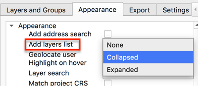

6. Make any other desired appearance changes. For example, and a layer search, measure tool, or have a custom map extent (how far someone can zoom in, out, and around). Click Update preview to see how any changes will look.

7. Click the Export tab.

8. Click the three dots to the right of Exporter to make sure the output goes to the git repository.

  

9. Navigate to the git repository and choose **Open**.

  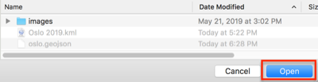

10. In the Export to web map window in QGIS, click Export at the bottom of the window.

  

11. When the map successfully exported, click OK. The log will show **Success** and the export file path if it is successful.

### Editing qgis2web index.html file
1. Navigate to the qgis2web export in the git repository.

  

2. Rename the qgis2web folder to **webapp**. This rename will be important at a later step.

3. Open the folder, which is now named webapp in this tutorial, and double click the **index.html** file. The map will open in the default web browser. If for some reason the map is not appearing, right click the file and select choose with to open it with another web browser (e.g., Firefox instead of Chrome).

4. Keeping the map in the browser open, **right click the index.html file** and choose **Open with...** and select **Atom.app**.

  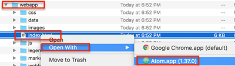

    - As changes are made in the following steps, use command + S or File>Save to save edits.

    - Periodically refresh the browser window with the map that is open to see the changes.

    - If the for any reason the map disappears, troubleshoot the code in index.html file by using command + z to undo any previous changes. Check to see: was a colon or curly bracket accidentally deleted? Were all variable names changed and spelled correctly?

4. Within the head tags `<head>`, delete line 6, which begins `meta name="viewport"...`.

  

5. Copy and paste all of the following lines of code in its place or anywhere in the head `<head>` above the style tag `<style>`. Leaflet is a meant to create mobile and web responsive maps, but these will help even more.

```js
<!-- Mobile meta tags to go in head-->
<meta name="HandheldFriendly" content="True">
<meta name="viewport" content="width=device-width, initial-scale=1.0, maximum-scale=1.0, user-scalable=no" />
<meta name="MobileOptimized" content="320"/>
<meta name="apple-mobile-web-app-capable" content="yes">
<meta http-equiv="cleartype" content="on">
```

  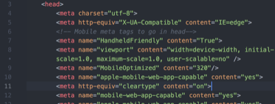

6. In style `<style>` section of the head, paste the following code in **line 23** after the closed curly bracket. **Note**: the line could be different if you did not paste the code from the previous step exactly as shown, so just look for the line directly above the closed style tag `</style>`. This code sets a min width and height for the map popups and adds scrolling capabilities. Change the min-width and min-height to meet your needs.

```js
<!--min width to go in head for #map style popup content-->
.leaflet-popup-content {
min-width: 200px;
min-height: 100px;
overflow-y: scroll;
}
```
  

8. (Optional) Delete the custom marker code to use the default Leaflet marker.

9. Use command + F to find `marker`.

  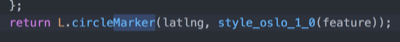

10. Change `L.circleMarker` to `L.marker` to use the default Leaflet balloon markers instead of the one exported from QGIS. No need to delete any of the function `style_oslo_1_0`, Leaflet will now ignore it.

9. (Optional steps 9-12) Change the basemap to the Google Earth and Streets hybrid basemap.

9. Use command + F to find `var layer_OSMStandard_0`.

10.  Delete the lines of code that are as follows:

```    js
var layer_OSMStandard_0 = L.tileLayer('http://tile.openstreetmap.org/{z}/{x}/{y}.png', {
            opacity: 1.0,
            attribution: '<a href="https://www.openstreetmap.org/copyright">© OpenStreetMap contributors, CC-BY-SA</a>',
        });
        layer_OSMStandard_0;
```
11. Replace the code with the following:

``` js
var googleHybrid = L.tileLayer('https://{s}.google.com/vt/lyrs=s,h&x={x}&y={y}&z={z}',{
    maxZoom: 20,
    opacity: 1.0,
    subdomains:['mt0','mt1','mt2','mt3']
  });

googleHybrid;
```
12. Do a find and replace (command + F) for anything else that remains as `layer_OSMStandard_0` and replace it with `googleHybrid`

  

13. (Optional) Edit the legend to reflect the changes made such as the new basemap name and to remove the old marker image.

7. Open **find and replace** (command + F) to find all instances of **http:** web addresses and replace it with **https:**. Only do this wil web addresses and NOT any http instances within a variable name or tag). This is necessary so that the final map does not create an insecure connection on websites. If this is not done, the website the map is embedded will appear as insecure.

  

  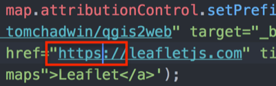

14. Use command + F to find the line `L.control.layers`.

  

15. If the places marker was changed, delete the image path. Also, capitalize or change the name of the layer. If the Google Hybrid basemap was used, replace the OSM Standard name in quotations with something like Google basemap

  

  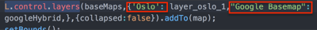

16. Back in the git repository with the webapp file, double click the index.html file to open it in a web browser. Do the changes appear? If the map is not appearing at all, try to troubleshoot the code in the index.html file: was a colon or curly bracket accidentally deleted? Were all variable names changed if choosing a new basemap?
