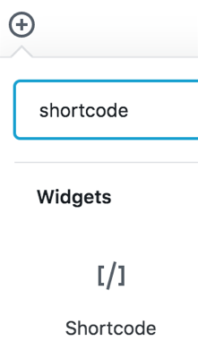

# Hosting with GitHub Pages and Embedding on a Website

### Push changes to GitHub
1. Open GitHub Desktop.

2. From the top left, make sure the current repository is the one with all of the data and leaflet files.

  

3. At the bottom, provide at least a summary for the changes and a description if desired, and click **Commit to master**.

  

4. In the top right, click **Push origin**.

  

### Create gh-pages
1. Once everything is uploaded, or *pushed*, to GitHub, click **Current Branch**, which is between Current Repository and Push origin. The current branch probably says master.

  

2. Click **New Branch**.

  

3. Name the new branch **gh-pages**. The branch **must** be named gh-pages. Naming a branch gh-pages tells GitHub that the branch should function as [GitHub Pages](https://help.github.com/en/articles/what-is-github-pages), GitHub's hosting services.

  

4. Click Create Branch.

5. Click Publish branch.

6. Now you can see the map at the branch's GitHub Pages site at YourGitHubAccount.github.io/gitRepositoryName/webapp.
  - YourGitHubAccount = replace with your GitHub account named
  - .github.io/ = keep as is
  - gitRepositoryName = input the git repository name
  - webapp = this is the file that originally had the long qgis2web title and was changed to webapp in the section **Editing qgis2web index.html file**

For example, [havemaps.github.io/2019_oslo/webapp](https://havemaps.github.io/2019_oslo/webapp/#13/59.9096/10.7292)

## Integrating with a website
The simplest way to embed the Leaflet map into a website is with an iframe. This may or may not be possible depending on the content management system being used.

Iframe html tags <iframe> do not seem to be compatible with  free, personal instances of WordPress as of May 2019. The best reason I could find was "due to security reasons"

Iframe html tags (e.g., `<iframe src=" ">`) work with some university institutional instances of WordPress.

If you want to integrate the exported qgis2web map with a personal or business WordPress that does not allow the iframe html tags there are a couple ways to do it:

1. A **business plan** is required to access the [iframe plugin](https://wordpress.org/plugins/iframe/).
2. A **hosting service** that allows you to upload html pages in the WordPress source code.

### Using the iframe html tag
This option may work with some self-hosted websites or institutionally hosted WordPress accounts.

1. Create a new page or post in the content mamangement system. This example uses WordPress.

2.  Using the **classic editor**, choose **Text** instead of Visual.

3. Use the html iframe tag: `<iframe src=" " width=" " height=" "></iframe>`

4. Between the **iframe src= quotation marks**, paste the link to the **GitHub Pages** (gh-pages branch) for the project repository. It should look like https://YourGitHubAccount.github.io/repoName/webapp.

5. Between the width and height quotations, set the width and height of the map. For example, the final html might look like: `<iframe src="https://havemaps.github.io/2019_oslo/webapp" width="800" height="400"></iframe>`. Also try adding scrolling="no". This may not work for all content management systems.

6. Click Preview to check out how it appears.

### WordPress iframe plugin

1. Create a new page or post.

2. Using the blocks editor, choose **Shortcode** as the widget type.

  

3. Type `[iframe src=" " scrolling="no"]`. If you would prefer to have scroll bars on the map, type `scrolling="yes"` or do not use the `scrolling=` at all.

4. Between the **iframe src= quotation marks**, paste the link to the **GitHub Pages** (gh-pages branch) for the project repository. It should look like https://YourGitHubAccount.github.io/repoName/webapp

5. `[iframe src="https://havemaps.github.io/2019_oslo/webapp" scrolling="no"]`

5. Click Preview to check out how it appears.

## Map text description

Maps are great! However, they may not be accessible to all online users. Below the map, include a thorough text description. A thorough text description gives an equivalent experience to all users.

For example, if the map is of places, make an effort to provide a narrative or list that describes the places as they are in the map.
Starting in a spreadsheet helps with the text description process because it makes it easy to directly copy column information into the post editor. Make an effort to arrange the place descriptions in a way that will make narrative sense to the reader.

Find live examples of map text descriptions on [my About page](https://havemapswilltravel.com/about) (click Expand text description) and all of my posts such as [Musandam 2019](https://havemapswilltravel.com/2019/05/15/20190404-musandam/).
